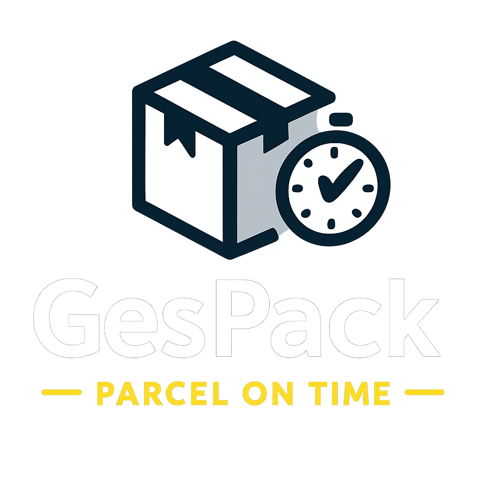

<p align="center">
  
</p>

# 📦 GesPack – Monorepo de Gestión Multiempresa

**GesPack** es una solución integral para la gestión de pedidos, clientes, inventario, facturación y comunicaciones, diseñada para entornos multiempresa (multi-tenant). Incluye frontend (React), backend (Node/NestJS), documentación y scripts de despliegue, todo organizado en un único repositorio.

---

## 🗂️ Estructura del monorepo

```plaintext
GesPack/
├── backend/          # API y lógica de negocio (Node.js + NestJS)
├── frontend/         # Aplicación web (React + TypeScript)
├── docs/             # Documentación técnica y funcional (Markdown)
├── postgresql/       # Scripts de base de datos, migraciones y modelos
├── scripts/          # Utilidades y scripts de despliegue automático
└── ...               # Otros recursos, configuraciones y utilidades
```

---

## 🚀 ¿Qué incluye GesPack?

* **Backend API:** Gestión de clientes, pedidos, productos, inventario y facturación.
* **Frontend web:** Interfaz de usuario moderna, responsiva y multiusuario.
* **Multi-tenant:** Aislamiento completo por cliente (`site_id` en todas las tablas).
* **Documentación:** Manuales, diagramas y especificaciones técnicas completas en `/docs`.
* **Scripts de despliegue:** Bash para automatización de copias y reinicio de Docker.
* **Migraciones PostgreSQL:** Scripts y modelos optimizados para despliegue multiempresa.

---

## 🛠️ Despliegue rápido local y en servidor

### **1. Clonar el repo**

```bash
git clone git@github.com:TuUsuario/GesPack.git
cd GesPack
```

### **2. Revisar scripts de deploy**

En `/scripts/` y en los manuales de `/docs/` tienes instrucciones para:

* **Desplegar Frontend y Backend** en servidores Ubuntu vía `rsync` y Docker
* **Automatizar el proceso con GitHub Actions o scripts Bash**
* **Configurar Stormshield, NAT, y DNS para publicación web**

### **3. Base de datos**

* Todos los modelos y scripts `.psql` en `/postgresql/`
* Diseño multi-tenant, compatible con PostgreSQL 16.x
* Diagrama ER y explicación de relaciones en `/docs/`

---

## 📝 Documentación y ayuda

* **Manual de despliegue**: `/docs/Manual Deploy GesPack Frontend – Mac a Ubuntu.md`
* **Manual Stormshield**: `/docs/Manual Stormshield – Publicar GesPack.md`
* **Modelo de datos**: `/docs/README.md`
* **Preguntas frecuentes y buenas prácticas**: incluidas en cada manual y en la documentación global.

---

## 💡 Buenas prácticas en GesPack

* **Todos los nombres de tablas y campos en inglés** y `snake_case`
* **Auditoría completa:** Todas las tablas tienen campos `created_by`, `created_at`, `modified_by`, `modified_at`
* **site\_id obligatorio** en tablas principales y foráneas
* **Índices y claves foráneas** definidos para optimizar rendimiento y consistencia
* **Scripts de backup y restauración** recomendados en `/scripts/`

---

## 👥 Contribuir

1. Abre un Issue o Pull Request para sugerencias o cambios
2. Sigue la estructura del monorepo
3. Actualiza la documentación si tu cambio afecta a la lógica de negocio o estructura de datos

---

## 📧 Contacto

* **Responsable del proyecto:** Iván López
* **Email:** [ilopez@parcelontime.es](mailto:ilopez@parcelontime.es)

---

## 📄 Licencia

Este proyecto y su documentación son propiedad exclusiva de Parcel On Time S.R.L.
Queda prohibida la copia, reproducción o distribución total o parcial sin el consentimiento expreso del titular.
© 2024 Iván / Parcel On Time S.R.L. – Todos los derechos reservados.

---

## 🌐 Enlaces útiles

* [GesPack en producción](https://gespack.parcelontime.es) (si está publicado)
* [Documentación de migración SQL → PostgreSQL](docs/README.md)
* [Diagrama ER completo](docs/ER-Diagram.png)
